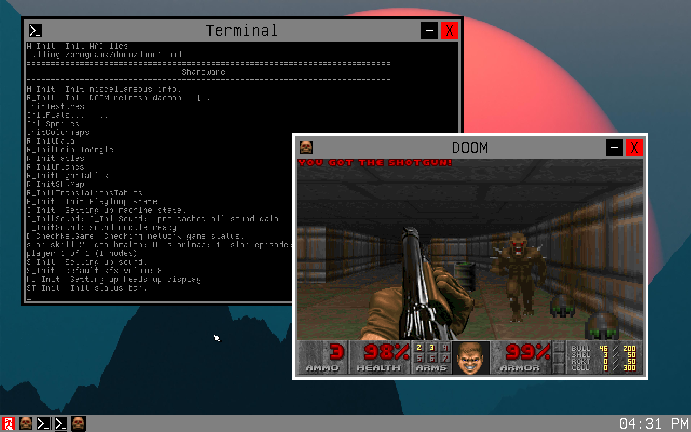

# NAUL (Not A Unix Like)
My operating system which is my own very Unix unlike OS, kinda the OS analogue of:


## Screenshots
Here are some screenshots of NAUL, click on them to view them in full scale:
<table>
    <tr>
        <td><a href="images/image1.png"></a></td>
        <td><a href="images/image2.png"></a></td>
    </tr>
    <tr>
        <td><a href="images/image3.png"></a></td>
        <td><a href="images/image4.png"></a></td>
    </tr>
</table>

## Downloading
You can download the latest iso file from the release here: https://github.com/korbykob/NAUL/releases/download/latest/naul.iso

This file is automatically generated to be up to date with the latest commit.
## Emulating
To run this within QEMU, download the UEFI bios from [here](https://github.com/korbykob/NAUL/raw/refs/tags/latest/OVMF-pure-efi.fd) and use the following flags to ensure emulation speed:
```
qemu-system-x86_64 -enable-kvm -bios OVMF-pure-efi.fd -drive file=naul.iso,media=cdrom,if=virtio -m 4G -cpu host,migratable=off
```
## Features
- UEFI bootloader
- Long (64 bit) mode
- AVX2
- Serial
- Graphics
- PSF font parsing
- PS/2 keyboard support
- PS/2 mouse support
- Allocator
- Paging
- LAPIC timer support
- HPET timer support
- Ram filesystem
- Multithreading (and mutexes)
- Symbol tables
- Processes
- Terminal
- Syscalls
- IPC
- Real time clock
- ACPI power modes
- Desktop mode
## Plans
You think I have plans? Pfft. Everything I say I'll never do, I end up doing anyways.
## Building
First clone the repo and its submodules:
```
git clone --recursive https://github.com/korbykob/NAUL.git
```
After cloning ensure you have gcc (gcc-x86-64-linux-gnu), binutils (binutils-x86-64-linux-gnu), and mtools installed and run:
```
cd NAUL
./naul.sh iso
```
Now you will see a file called "naul.iso" in the root directory, to try this in QEMU run:
```
./naul.sh run
```
